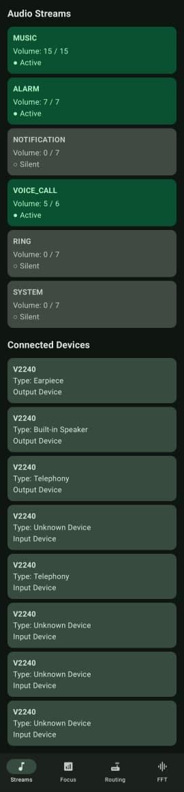
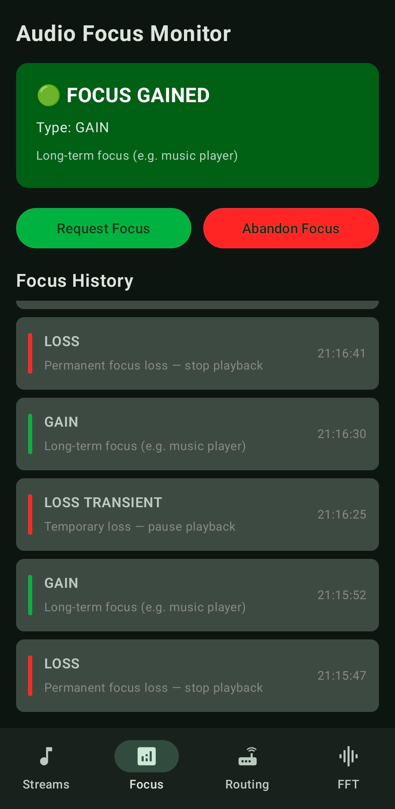
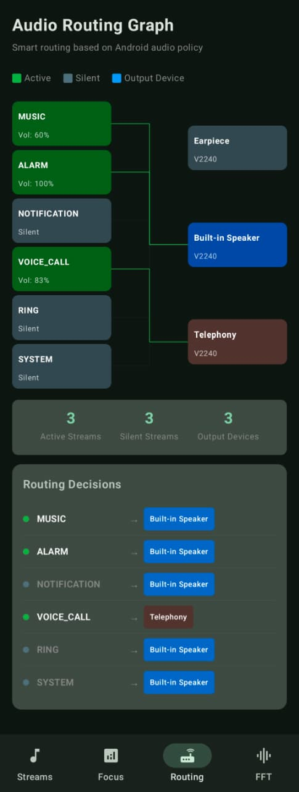
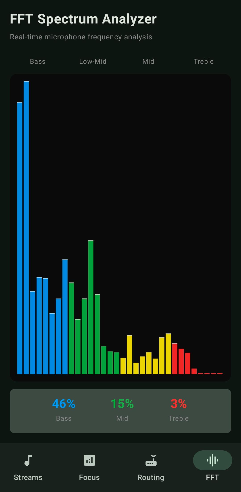

# Android System Audio Analyzer

> *Because Android's audio system deserves more than a volume slider.*

A real-time diagnostic tool that pulls back the curtain on Android's internal audio subsystem — exposing live stream states, audio focus transitions, routing paths, and a custom-built FFT frequency spectrum analyzer. Built entirely with modern Android stack, zero shortcuts.

---

## Screenshots

| Stream Dashboard | Focus Monitor |
|:---:|:---:|
|  |  |

| Routing Graph | FFT Visualizer |
|:---:|:---:|
|  |  |

---

## Why Does This Exist?

I joined Visteon as a SWE Android Audio in August 2025, working on automotive infotainment systems. Every day I was writing code that touched Android's audio layer — navigation prompts interrupting music, phone calls routing to car speakers, alerts ducking background audio. I was using these APIs but I genuinely had no idea what was happening underneath.

I kept asking myself: when a navigation prompt fires, what exactly happens to the music stream? Which device does it route to? Who wins the audio focus battle? The Android docs gave me the what. They never gave me the why.

So I built this app to see it. Not read about it — actually see it, live, on a real device. Every state change, every focus transition, every routing decision — visualized in real time.

What started as scratching my own itch turned into the deepest dive I have taken into any platform subsystem. And honestly, I am glad I did not fully know what I was getting into.

---

## What It Does

### Stream Dashboard
Monitors all active Android audio streams in real time — MUSIC, ALARM, NOTIFICATION, VOICE_CALL, RING, and SYSTEM. Shows live volume levels, active/silent states, and all connected audio output devices. Updates every second via a coroutine polling loop backed by StateFlow.

### Audio Focus Monitor
Tracks every audio focus transition with full state history and timestamps. Handles all 8 focus states defined in Android's AudioFocusRequest API:

- AUDIOFOCUS_GAIN — Long-term focus (music player)
- AUDIOFOCUS_GAIN_TRANSIENT — Brief focus (navigation prompt)
- AUDIOFOCUS_GAIN_TRANSIENT_MAY_DUCK — Others may lower volume
- AUDIOFOCUS_GAIN_TRANSIENT_EXCLUSIVE — Exclusive, no ducking
- AUDIOFOCUS_LOSS — Permanent loss, stop playback
- AUDIOFOCUS_LOSS_TRANSIENT — Temporary loss, pause playback
- AUDIOFOCUS_LOSS_TRANSIENT_CAN_DUCK — Lower volume, keep playing
- AUDIOFOCUS_NONE — No focus held

Color coded in real time: Green for Gain, Red for Loss, Grey for None.

### Audio Routing Graph
A live Canvas-drawn graph showing how each audio stream routes to its output device — built on top of Android's actual AudioPolicyManager routing rules. Not guessed. Not approximated. The same priority logic the OS uses, implemented from the framework source:

- MUSIC routes to BT A2DP, then USB Headset, then Wired, then Built-in Speaker
- VOICE_CALL routes to BT SCO, then Wired Headset, then Telephony, then Earpiece — never speaker
- RING, ALARM, and SYSTEM always route to Built-in Speaker only per Android safety policy
- NOTIFICATION routes to music target and Speaker as dual output

Includes a Routing Decisions panel with color-coded device chips that updates live as devices connect and disconnect.

### FFT Spectrum Analyzer
Real-time frequency visualization using AudioRecord at 44.1kHz. The FFT is implemented from scratch — no libraries. Cooley-Tukey algorithm with Hann windowing, 1024-point transform grouped into 32 frequency bands. Color coded by range: Blue for Bass, Green for Mid, Yellow for High-Mid, Red for Treble. Live Bass/Mid/Treble percentage stats update at 20fps.

---

## Architecture

    AudioAnalyzer/
    AudioAnalyzerApp.kt       @HiltAndroidApp
    AudioViewModel.kt         @HiltViewModel, StateFlow pipeline
    MainActivity.kt           @AndroidEntryPoint, Navigation + 4 screens
    data/
        db/                   Room database, DAO, Entity
        model/                AudioStreamInfo, AudioDeviceInfo, AudioFocusInfo
        repository/
            AudioRepository.kt          Interface
            AudioRepositoryImpl.kt      AudioManager + AudioRecord + FFT
    di/
        AppModule.kt          Hilt module
    screens/
        StreamDashboardScreen.kt
        FocusStateScreen.kt
        RoutingGraphScreen.kt     AudioRoutingPolicy object
        FFTVisualizerScreen.kt

Pattern: MVVM, Single ViewModel, StateFlow for reactive UI updates, Repository abstracts all Android audio APIs, Hilt for DI throughout

---

## Technical Highlights

**Custom FFT — No Libraries**
The frequency analyzer implements the Cooley-Tukey radix-2 DIT FFT algorithm entirely in Kotlin. Bit-reversal permutation, butterfly operations, Hann windowing for spectral leakage reduction. 512 output bins grouped into 32 display bands. This was a deliberate choice — understanding the algorithm matters more than importing it.

**AudioPolicyManager Routing Logic**
Android does not expose a public API that tells you which stream is currently routed to which device. That mapping lives inside AudioPolicyManager — a native C++ service. I studied the Android framework source and re-implemented the priority chain in Kotlin as AudioRoutingPolicy.shouldConnect(). Type-based matching, not ID-based, because HAL device IDs are not stable across sessions.

**AudioFocus Architecture**
Built on AudioFocusRequest (API 26+) with full backward compatibility via the deprecated requestAudioFocus for older APIs. The focus listener feeds a MutableStateFlow that drives both the current state card and the scrollable history log — all without a single LiveData or callback leak.

**Coroutine-Driven Data Pipeline**
AudioRecord reads happen on Dispatchers.IO via a flow builder with flowOn. The ViewModel collects on the main thread via viewModelScope. No thread management code anywhere in the UI layer.

---

## The Hard Parts

I will not pretend this was smooth.

The routing graph broke my brain for longer than I would like to admit. The lines connecting streams to devices kept drawing to the wrong targets. I had the logic right, the math right — but something in how Compose's Canvas DrawScope captures variables was giving me stale state. The fix was moving the entire connection matrix computation outside the Canvas lambda into the Composable scope. Simple in hindsight. Absolutely not obvious when you are staring at it at 11pm.

The FFT was the other one. Not the algorithm itself — that is well documented. The tricky part was realizing that without a Hann window function, the spectrum looked like noise even with correct audio input. Spectral leakage is real and it will humble you.

---

## What This Taught Me

I thought I knew Android's audio system after a year of internship and full-time journey in this domain. I did not. I knew the surface.

The thing that genuinely surprised me was how much of Android's audio behavior is policy, not mechanism. The OS does not technically prevent you from routing RING to a Bluetooth headset. It just has a policy that says it should not. Understanding the difference between what the platform can do and what it chooses to do — that was the real lesson.

Also: AudioFocus is a gentleman's agreement. Apps are expected to honor it. Nothing forces them to. That is a fascinating design choice for a platform used by billions of devices.

---

## Tech Stack

| Layer | Technology |
|-------|-----------|
| Language | Kotlin |
| UI | Jetpack Compose + Material 3 |
| Architecture | MVVM + StateFlow |
| DI | Hilt |
| Database | Room |
| Audio APIs | AudioManager, AudioRecord, AudioFocusRequest, AudioDeviceInfo |
| Navigation | Navigation Compose |
| Concurrency | Kotlin Coroutines + Flow |
| Build | Gradle KTS + KSP |

---

## Running the Project

    git clone https://github.com/meghnabardhan/AudioAnalyzer.git

Open in Android Studio Panda 4 (2025.3.4) or later.
Connect a physical device — AudioRecord requires real hardware.
Run the app — microphone permission required for FFT screen.

A physical device is required. The audio APIs used in this project do not behave correctly on emulators.

---

## About

**Meghna Bardhan**
Software Engineer at Visteon — working on Android-based automotive infotainment systems.

Started Android development during my internship at Visteon in January 2025. This project was built outside work hours to understand the audio subsystem I work with every day at a level the job alone would not give me.

[GitHub](https://github.com/meghnabardhan) · [LinkedIn](https://www.linkedin.com/in/meghna-bardhan/)

---

*Built with curiosity, a lot of Gradle errors, and the firm belief that the best way to understand a system is to take it apart.*
